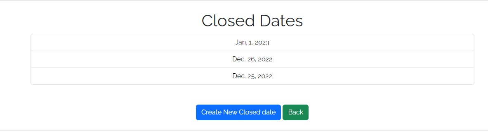
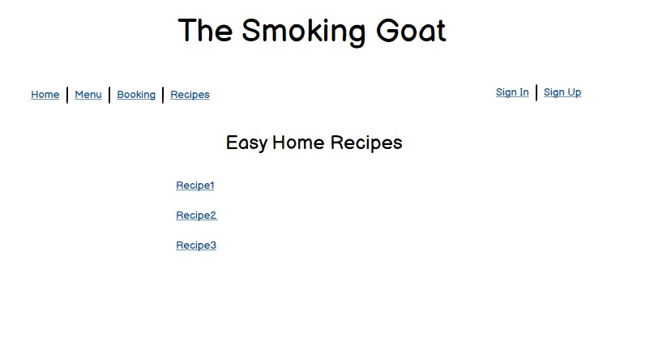

 <h1 align="center">The Smoking Goat</h1>

[View the live project here](https://the-smoking-goat.herokuapp.com/)

The Smoking Goat is a website for a restaurant that allows bookings to be made by registered users. It also allows users access to recipes created by the chef. The website allows staff to update the menu, add or remove items. Staff members can also  edit, delete or create new recipes on the site without accessing the admin panel. The staff also has access to a list of bookings for a given day and can add, edit or delete days that the restaurant is not open ex. Christmas day. The booking system only takes 5 bookings per time slot for up to 6 people per booking. If the time is fully booked the time will not be available when making a booking.

## Index – Table of Contents
* [User Experience (UX)](#user-experience-ux) 
* [Features](#features)
* [Design](#design)
* [Planning](#planning)
* [Technologies Used](#technologies-used)
* [Testing](#testing)
* [Deployment](#deployment)
* [Credits](#credits)

## User Experience (UX)

### User stories :

* US01:Display purpose of application through UI
  - As a **Site User** I can **view the landing page** so that **I can determine the purpose of the application**
* US02: Navigate site
  - As a **Site User** I can **navigate using the navigation links** so that **I can easily access application functionality**
* US03: View menu
  - As a **Site User** I can **view the menu of the restaurant** so that **I can see all the options available and the prices**
* US04: Register/Login
  - As a **Site User** I can **register** so that **they can have access to the booking features and the recipes**
* US05: Make a booking
  - As a **Site User** I can **make a booking** so that **I can visit the restaurant at a time I can choose**
* US06: View bookings
  - As a **Site User** I can **access a list of my bookings** so that **I can see what day and time I have a booking**
* US07: Cancel booking
  - As a **Site User** I can **cancel a booking** so that **a place is no longer reserved for me**
* US08: View Recipes
  - As a **Site User** I can **view a list of the Recipes** so that **I can use it at home**
* US09: Password reset
  - As a **Site User/ staff member** I can **reset my password** so that **I can get access to the site if I forgot my password**
* US10: Closed days
  - As a **Staff member** I can **add, edit, delete or view a closed day** so that **I can edit, delete or create a closed day**
* US11: Recipe create
  - As a **Staff member** I can **view a list of recipes** so that **I can create, edit or delete a recipe**
* US12: Staff
  - As a **Staff member** I can **login** so that **I can access the features available to the staff members**
* US14: Manage Menu
  - As a **Staff member** I can **create, read, update and delete menu items** so that **I can manage the menu**
* US15: Customer booking list
  - As a **Staff member** I can **view a list of bookings for a given day** so that **I can plan for the day**
* US16 Contact details
  - As a **Site User** I can **view the restaurants contact details opening times and contact number** so that **I have the details and contact the restaurant if I have more questions**

## Features

### Existing Features

-   __F01 Navigation Bar__
    
    The navigation bar has a consistent look and placement each page supporting easy and intuitive navigation.  It includes a Logo, and a link to the Home page. If the user is not signed in then links are available to the Register and Sign in pages and if logged in a logout link replaces the login/signup link.  If the user is not signed in the recipes and booking links redirects to the login page.
    
    If the user signed in is a staff member then an additional link of Recipe List and Menu List is shown.
    
    
    
    

-   __F02 Landing page__
    
    The landing page features a hero image of food with a link inviting the user to go to the menu page. Two smaller cards are displayed at the bottom indicating other features available on the site. If users are not logged in the links on the cards will redirect them to the login page else they will be redirected to the respective pages.

    

-   __F03 Footer__
    
    The footer displays the opening times, the location and contact details. There is also a links to mail the restaurant and opens your email. It also contains the social media links.

    

-   __F04 Menu page__
    
    The menu page can be accessed by any user and does not require registration. It displays the starters, mains and deserts offered by the restaurant. The dish name with a short description and a price is displayed

    
    
    

-   __F05 Login/ Sign-up__
    
    The users must be signed in to access the recipes page and the booking page.

    
    

-   __F06 Booking page User__
    
    The booking page displays a input to choose a day for a visit to the restaurant. When you choose a day the page renders the rest of the form. The form must be completed name, surname, telephone number amount of people and the times available. If a time is fully booked it will not appear in the available times. When a booking is confirmed the page redirects to the booking details.
    
    The booking page has a link to view your bookings in a list. If you click on one of the bookings it opens a page with the details of the booking and allows you to delete the booking
    
    
    
    
    
    

-   __F07 Recipe page User__
    
    The recipe link in the navigation directs the logged in user to a list that displays the recipes created by the chef. The user can choose a recipe and click on the link that will redirect them to a page that displays the details of the recipe 

    
    
    

-   __F08 Booking page Staff__
    
    Staff members accessing the booking page has more options to choose from. There is a closed list that redirects them to a closed day list, there is also a link to create a new closed day. The link create new closed day will display a form to be completed and when posted will redirect to the item created. They can access a closed day by selecting one from the list and it will redirect them to a detail page where they can edit or delete the item. 

    The booking list link redirects them to a page with an input. They can select a day and it will display the booking for that day. If there are no bookings a message will display saying there are no bookings for that day.

    
    
    
    
    

-   __F09 Menu list(Staff member)__
    
    the Menu list page can only be accessed by a staff member. It displays a list of all the items on the menu. When a item is selected it displays the items details and the staff member can edit the item or delete it.
    The menu list page has a link to create a new menu item and will display a from to be completed.

    
    
    

-   __F10 Recipe List(Staff members)__
    
    The Recipe list navigation link is only displayed to staff members. The link displays a recipe list page and has a link to create new recipes. The create new recipe page displays a from to be completed to create a new recipe. 

    When a recipe is selected from the list the details of the recipe is displayed with links to edit or delete the recipe.

    
    
    

### Features which could be implemented in the future

-   __Social login__
    
    Add login by using social accounts

-   __Recipe likes__
    
    Implement function for users to like recipes 

## Design

-   ### Wireframes
Balsamiq was used to create the wire frames for the project and was used as a guide for the project

**Database Design**

- PostgreSQL was used for the database

**Recipe Post**
- Stores all the data for the recipes

| **Key**        |  **Type**     | **Purpose**|
|-------------- |-------------- |-------------|
| _id           |  ObjectId     | ObjectId of this document
| title   |   String      | stores the title of the recipe
| author     |   User Id     | stores the id of the User object
| content     |   String      | stores the content of the recipe
| featured_image        |   Image      | stores a image of the recipe
| created_on      |   date      | stores the date the recipe was created 

**TimeSlot**
- Stores all the bookings made by customers

| **Key**        |  **Type**     | **Purpose**|
|-------------- |-------------- |-------------|
| _id           |  ObjectId     | ObjectId of this document
| date   |   string      | stores the date of the booking
| time     |   string     | stores the time of the booking
| first_name     |   String      | stores the customers first name
| last_name        |   String     | stores the customers Last name
| phone      |   number     | stores the customers number
| number_of_people     |   number      | stores the number of people attending
| user      |   User Id      | stores the Users Id

**Closed**
- Stores all the dates the restaurant is closed

| **Key**        |  **Type**     | **Purpose**|
|-------------- |-------------- |-------------|
| _id           |  ObjectId     | ObjectId of this document
| day  |   date     | stores the date 
| reason    |   string     | stores the reason the store is closed
| user      |   User Id      | stores the Users Id that created the event

**FoodMenu**
- Stores all the menu items

| **Key**        |  **Type**     | **Purpose**|
|-------------- |-------------- |-------------|
| _id           |  ObjectId     | ObjectId of this document
| title  |   string      | stores the title of the dish
| description     |   string     | stores a short description of the dish
| course     |   number      | stores a number indicating to a course
| price        |   number    | stores the price of the dish

## Technologies Used

### Languages Used

-   [HTML5](https://en.wikipedia.org/wiki/HTML5)
-   [CSS3](https://en.wikipedia.org/wiki/Cascading_Style_Sheets)
-   [Python](https://www.python.org/)

### Frameworks, Libraries & Programs Used

-   [Google Fonts:](https://fonts.google.com/) used for the Raleway font
-   [Font Awesome:](https://fontawesome.com/) was used to add icons for aesthetic and UX purposes.
-   [Git:](https://git-scm.com/) was used for version control by utilising the Gitpod terminal to commit to Git and Push to GitHub.
-   [GitHub:](https://github.com/) is used as the respository for the project code after being pushed from Git. In addition, for this project GitHub was used for the agile development aspect through the use of User Stories (GitHub Issues) and tracking them on a Kanban board.
-   [Balsamiq:](https://balsamiq.com/) was used to create the wireframes during the design process.
-   [Django](https://www.djangoproject.com/) was used as the framework to support rapid and secure development of the application
-   [Bootstrap](https://getbootstrap.com/) was used to build responsive web pages
-   [Gunicorn](https://gunicorn.org/) was used as the Web Server to run Django on Heroku
-   [dj_database_url](https://pypi.org/project/dj-database-url/) library used to allow database urls to connect to the postgres db
-   [psycopg2](https://pypi.org/project/psycopg2/) database adapter used to support the connection to the postgres db
-   [Cloudinary](https://cloudinary.com/) used to store the images used by the application
-   [Django allauth](https://django-allauth.readthedocs.io/en/latest/index.html) used for account registration and authentication
-   [coverage](https://coverage.readthedocs.io/en/coverage-5.5/) used to check how much of the python code has been covered by 
automated tests

## Testing

### Validator Testing 

- [HTML Validator](https://validator.w3.org/)

    - As this project uses Django templates the html has been validated by manually clicking through the application pages, copying the source of the rendered pages and then validating this version of the html using the W3C Validator (link shown above).

    - Results: All pages passed without errors except the Recipe detail page. An error was indicated for use of % in width attribute in image tag, expected a number.
  

- [CSS Validator](https://jigsaw.w3.org/css-validator/)

  - Results: No errors were found in style.css

- [Python Validator](http://pep8online.com/)

  

    
Booking admin.py

  [Booking admin.py](pep8/booking_admin.txt)
  

  
  

    
Booking models.py

    
  [Booking models.py](pep8/booking_models.txt)
  

  

    
Booking test_views.py

    
  [Booking test_views.py](pep8/booking_test_views.txt)
  

  

    
Booking views.py

    
  [Booking views.py](pep8/booking_views.txt)
  

  
  

    
Easy Recipes admin.py

    
  [Easy Recipes admin.py](pep8/easy_recipe_admin.txt)
  

  
  

    
Easy Recipes models.py

    
  [Easy Recipes models.py](pep8/easy_recipe_models.txt)
  

  

    
Easy Recipes test_views.py

    
  [Easy Recipes test_views.py](pep8/easy_recipe_test_views.txt)
  

  

    
Easy Recipes views.py

    
  [Easy Recipes views.py](pep8/easy_recipe_views.txt)
  

  

    
Home views.py

    
  [Home views.py](pep8/home_views.txt)
  

  

    
Menu admin.py

    
  [Menu admin.py](pep8/menu_admin.txt)
  

  

    
Menu models.py

    
  [Menu models.py](pep8/menu_models.txt)
  

  
  

    
Menu test_views.py

    
  [Menu test_views.py](pep8/menu_test_views.txt)
  

  

    
Menu views.py

    
  [Menu views.py](pep8/menu_views.txt)
  

### Automated Testing

   - [Django testing tools](https://docs.djangoproject.com/en/3.2/topics/testing/tools/) were used to test the application python code.  
   - DB tests were run in the development environment against a local SQLite3 database. 
   - Tests were written for the following files :

      - Booking tests for [views.py](booking/views.py):  test file: [test_views.py](booking/test_views.py)
      - Easy Recipe tests for [views.py](easy_recipe/views.py): test file: [test_views.py](easy_recipe/test_views.py)
      - Menu tests for [views.py](menu/views.py):  test file: [test_views.py](menu/test_views.py)
      - Home tests for [views.py](home/views.py): test file: [test_views.py](home/test_views.py)

  - Django test results and coverage :   
    
    

### Browser Compatibility

- Chrome DevTools was used to test the responsiveness of the application on different screen sizes.
 
    
### Manual Testing Test Cases and Results

- The application was tested for both site users and staff users. Recipes was added, updated and deleted. Menu add items, edit and delete items was tested. Booking was tested for two users booking at the same time for the same time slot. The reset password was tested with the email confirmation. Adding, deleting and editing closed days was tested. Customer booking and deleting was tested. All links and navigation links were tested.

### Known bugs

- Currently no known bugs.

## Deployment

### How to Clone the Repository 

- Go to the https://github.com/louwJohan/project4-ci repository on GitHub 
- Click the "Code" button to the right of the screen, click HTTPs and copy the link there
- Open a GitBash terminal and navigate to the directory where you want to locate the clone
- On the command line, type "git clone" then paste in the copied url and press the Enter key to begin the clone process
- To install the packages required by the application use the command : pip install -r requirements.txt
- When developing and running the application locally set DEBUG=True in the settings.py file
- Changes made to the local clone can be pushed back to the repository using the following commands :

  - git add *filenames*  (or "." to add all changed files)
  - git commit -m *"text message describing changes"*
  - git push

- N.B. Any changes pushed to the master branch will take effect on the live project once the application is re-deployed from Heroku

### Create Application and Postgres DB on Heroku
- Log in to Heroku at https://heroku.com - create an account if needed.
- From the Heroku dashboard, click the Create new app button.  For a new account an icon will be visible on screen to allow you to Create an app, otherwise a link to this function is located under the New dropdown menu at the top right of the screen.
- On the Create New App page, enter a unique name for the application and select region.  Then click Create app.
- On the Application Configuration page for the new app, click on the Resources tab.
- In the Add-ons search bar enter "Postgres" and select "Heroku Postgres" from the list - click the "Submit Order Form" button on the pop-up dialog.
- Next, click on Settings on the Application Configuration page and click on the "Reveal Config Vars" button - check the DATABASE_URL has been automatically set up. 
- Add a new Config Var called DISABLE_COLLECTSTATIC and assign it a value of 1.
- Add a new Config Var called SECRET_KEY and assign it a value - any random string of letters, digits and symbols.
- The settings.py file should be updated to use the DATABASE_URL and SECRET_KEY environment variable values as follows :

  - DATABASES = {'default': dj_database_url.parse(os.environ.get('DATABASE_URL'))}

  - SECRET_KEY = os.environ.get('SECRET_KEY')

- In Gitpod, in the project terminal window, to initialize the data model in the postgres database, run the command : python3 manage.py migrate 
- Make sure the project requirements.txt file is up to date with all necessary supporting files by entering the command : pip3 freeze --local > requirements.txt
- Commit and push any local changes to GitHub.
- In order to be able to run the application on localhost, add SECRECT_KEY and DATABASE_URL and their values to env.py

### Configure Cloudinary to host images used by the application
- Log in to Cloudinary - create an account if needed.  To create the account provide your name, email and set up a password.  For "primary interest" you can choose "Programmable Media for image and video API".  Click "Create Account" and you will be sent an email to verify your account and bring you to the dashboard.
- From the dashboard, copy the "API Environment variable" value by clicking on the "Copy to clipboard" link.
- Log in to Heroku and go to the Application Configuration page for the application.  Click on Settings and click on the "Reveal Config Vars" button.
- Add a new Config Var called CLOUDINARY_URL and assign it the value copied from the Cloudinary dashboard, but remove the "CLOUDINARY_URL=" at the beginning of the string. 
- In order to be able to run the application on localhost, also add the CLOUDINARY_URL environment variable and value to env.py

### Connect the Heroku app to the GitHub repository
- Go to the Application Configuration page for the application on Heroku and click on the Deploy tab.
- Select GitHub as the Deployment Method and if prompted, confirm that you want to connect to GitHub. Enter the name of the github repository (the one used for this project is (https://github.com/louwJohan/project4-ci) and click on Connect to link up the Heroku app to the GitHub repository code.
- Scroll down the page and choose to either Automatically Deploy each time changes are pushed to GitHub, or Manually deploy - for this project Manual Deploy was selected.
- The application can be run from the Application Configuration page by clicking on the Open App button.
- The live link for this project is (https://the-smoking-goat.herokuapp.com/)

### Final Deployment steps
Once code changes have been completed and tested on localhost, the application can be prepared for Heroku deployment as follows :
- Set DEBUG flag to False in settings.py
- Ensure requirements.txt is up to date using the command : pip3 freeze --local > requirements.txt
- Push files to GitHub
- In the Heroku Config Vars for the application delete this environment variable :  DISABLE_COLLECTSTATIC
- On the Heroku dashboard go to the Deploy tab for the application and click on deploy branch

## Credits 

### Code 
- Much of the coding and testing relies heavily on information in the "Hello Django" and "I Think Therefore I Blog" walkthroughs in the Code Institue Full Stack Frameworks module. 
- 

### Media 
- The Raleway font used was imported from [Google Fonts](https://fonts.google.com/)
- Fontawesome was used for icons [Font Awesome](https://fontawesome.com/)
- The applicaiton favicon was created from the "exchange" icon image on [Font Awesome](https://fontawesome.com/) 
- Pexels.com was used for all the images[Pexels](https://www.pexels.com/)
  
